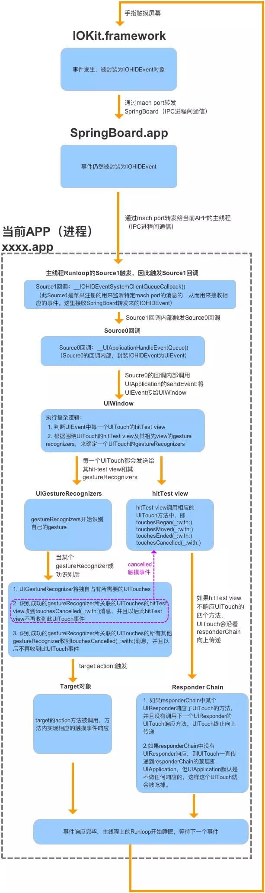

# iOS事件响应机制
### 事件生命周期
* ### 系统响应阶段
  1. 手指触碰屏幕，屏幕感应到触碰后，将事件交由IOKit处理。

  2. IOKit将触摸事件封装成一个IOHIDEvent对象，并通过mach port传递给SpringBoard进程。
  3. SpringBoard进程因接收到触摸事件，触发了主线程runloop的source1事件源的回调。

    此时SpringBoard会根据当前桌面的状态，判断应该由谁处理此次触摸事件。因为事件发生时，你可能正在桌面上翻页，也可能正在刷微博。若是前者（即前台无APP运行），则触发SpringBoard本身主线程runloop的source0事件源的回调，将事件交由桌面系统去消耗；若是后者（即有app正在前台运行），则将触摸事件通过IPC传递给前台APP进程，接下来的事情便是APP内部对于触摸事件的响应了。

    > mach port 进程端口，各进程之间通过它进行通信。 SpringBoard.app 是一个系统进程，可以理解为桌面系统，可以统一管理和分发系统接收到的触摸事件。

* ### APP 响应阶段
  1. APP进程的mach port接受到SpringBoard进程传递来的触摸事件，主线程的runloop被唤醒，触发了source1回调。

  2. source1回调又触发了一个source0回调，将接收到的IOHIDEvent对象封装成UIEvent对象，此时APP将正式开始对于触摸事件的响应。
  3. source0回调内部将触摸事件添加到 UIApplication 对象的事件队列中。事件出队后，UIApplication 开始一个寻找最佳响应者的过程，这个过程又称 hit-testing 。接下来如上面 事件传递 的解释
  4. 寻找到最佳响应者后，接下来的事情便是事件在响应链中的传递及响应了，关于响应链相关的内容详见[事件的响应及在响应链中的传递]一节。事实上，事件除了被响应者消耗，还能被手势识别器或是target-action模式捕捉并消耗掉。其中涉及对触摸事件的响应优先级
  5. 触摸事件历经坎坷后要么被某个响应对象捕获后释放，要么致死也没能找到能够响应的对象，最终释放。至此，这个触摸事件的使命就算终结了。runloop若没有其他事件需要处理，也将重归于眠，等待新的事件到来后唤醒。
   
